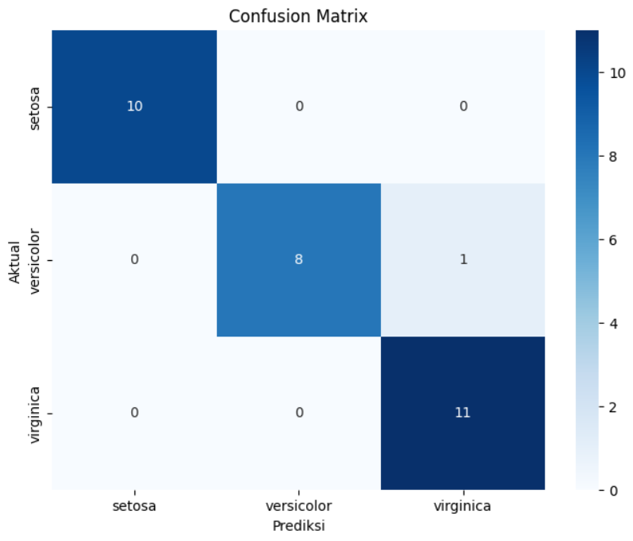

# **Klasifikasi Sederhana dengan SVM**

Proyek ini menerapkan klasifikasi menggunakan Support Vector Machine (SVM) dengan dataset *Iris*. Model ini dibuat menggunakan `scikit-learn` dan mencakup proses preprocessing, pelatihan, serta evaluasi model.

## **📌 Fitur Utama**
- Menggunakan dataset *Iris* dari `sklearn.datasets`
- Standarisasi fitur dengan `StandardScaler`
- Pelatihan model dengan `SVC` (Support Vector Classification)
- Evaluasi model dengan metrik `accuracy_score`, `classification_report`, dan `confusion_matrix`
- Visualisasi data dan hasil klasifikasi

---

## **📂 Struktur Folder**
```
├── Klasifikasi_SVM_Sederhana.ipynb  # Notebook utama proyek
├── README.md                        # Dokumentasi proyek
├── image.png                         # Contoh visualisasi hasil model
```

---

## **⚙️ Instalasi**
Pastikan Anda memiliki Python 3.x dan pustaka yang diperlukan telah terinstal.

1. Clone repository ini:
   ```bash
   git clone https://github.com/username/Klasifikasi_SVM_Sederhana.git
   cd Klasifikasi_SVM_Sederhana
   ```

2. Install dependencies:
   ```bash
   pip install -r requirements.txt
   ```

---

## **📊 Dataset**
Dataset yang digunakan adalah *Iris dataset* yang tersedia di `scikit-learn`. Dataset ini terdiri dari:
- 150 sampel
- 4 fitur (*sepal length*, *sepal width*, *petal length*, *petal width*)
- 3 kelas (*setosa*, *versicolor*, *virginica*)

---

## **🚀 Cara Menjalankan**
1. Jalankan Jupyter Notebook:
   ```bash
   jupyter notebook
   ```
2. Buka file `Klasifikasi_SVM_Sederhana.ipynb`
3. Jalankan setiap sel kode secara berurutan

---

## **📈 Hasil Evaluasi**
Model dievaluasi menggunakan beberapa metrik:
- **Akurasi**: Mengukur seberapa sering model mengklasifikasikan dengan benar.
- **Confusion Matrix**: Menunjukkan jumlah prediksi yang benar dan salah untuk tiap kelas.
- **Classification Report**: Memberikan metrik seperti precision, recall, dan F1-score.

Contoh hasil confusion matrix:
```
[[10  0  0]
 [ 0  9  1]
 [ 0  1  9]]
```

---

## **🖼️ Visualisasi**
Visualisasi data serta hasil klasifikasi dapat dilihat pada gambar berikut:




---

## **📜 Lisensi**
Proyek ini menggunakan lisensi **MIT**.

